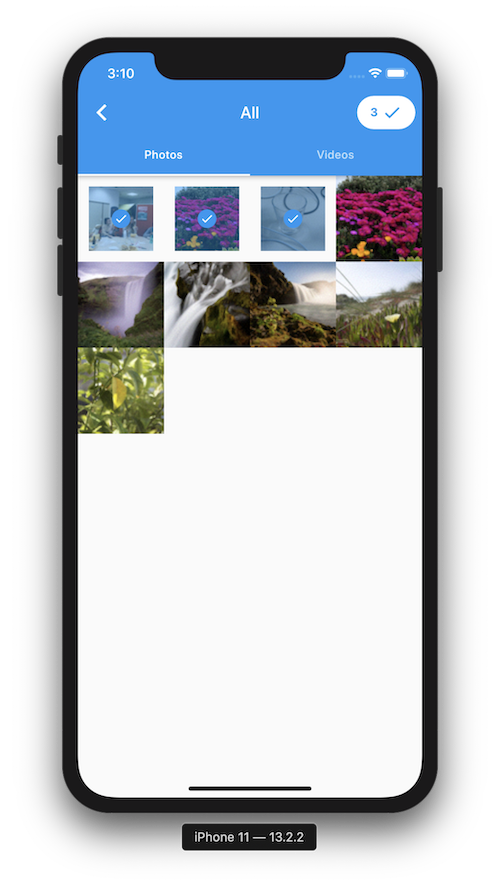

# Media Gallery plugin for Flutter

[](https://pub.dartlang.org/packages/media_gallery)

A Flutter plugin that lists native gallery items.

## Installation

First, add `media_gallery` as a [dependency in your pubspec.yaml file](https://flutter.io/platform-plugins/).

### iOS

Add the following keys to your _Info.plist_ file, located in `<project root>/ios/Runner/Info.plist`:

```xml
<key>NSPhotoLibraryUsageDescription</key>
<string>Example usage description</string>
```

### Android

Add the following permissions to your _AndroidManifest.xml_, located in `<project root>/android/app/src/main/AndroidManifest.xml`:

```xml
<uses-permission android:name="android.permission.WRITE_EXTERNAL_STORAGE" />
<uses-permission android:name="android.permission.READ_EXTERNAL_STORAGE" />
```

You should also manage those permissions (for example thanks to the [permission_handler](https://pub.dev/packages/permission_handler) plugin). You can see an [example](example) for more details.

### Usage

#### Listing media collections

``` dart
final MediaCollections collections = await MediaGallery.listMediaCollections(
    mediaTypes: [MediaType.image, MediaType.video],
);
```

#### Listing medias in a collection

``` dart
final MediaPage imagePage = await widget.collection.getMedias(
    mediaType: MediaType.image,
    take: 500,
);
final MediaPage videoPage = await widget.collection.getMedias(
    mediaType: MediaType.video,
    take: 500,
);
final List<Media> allMedias = [
    ...imageRange.items,
    ...videoRange.items,
]
..sort((x, y) => y.creationDate.compareTo(x.creationDate));
```

#### Loading more medias in a collection

```dart
if (!imagePage.isLast) {
    final nextImagePage = await imagePage.nextPage();
    // ...
}
```

#### Getting a file

```dart
final File file = await media.getFile();
```

#### Getting thumbnail data

```dart
final List<int> data = await media.getThumbnail();
```

#### Displaying thumbnails

`MediaThumbnailProvider`, `MediaCollectionThumbnailProvider` are available to display thumbnail images (here with the help of [transparent_image](https://pub.dev/packages/transparent_image)) :

```dart
FadeInImage(
    fit: BoxFit.cover,
    placeholder: MemoryImage(kTransparentImage),
    image: MediaThumbnailProvider(
        media: media,
    ),
)
```

#### Displaying medias

You can use `MediaImageProvider` to display an image (here with the help of [transparent_image](https://pub.dev/packages/transparent_image)):

```dart
FadeInImage(
    fit: BoxFit.cover,
    placeholder: MemoryImage(kTransparentImage),
    image: MediaImageProvider(
        media: media,
    ),
)
```

To display a video, you can use [video_player](https://pub.dev/packages/video_player).

#### Image/Video picker



You can build a gallery picker easily with this package.

See the [example](example) for more details.